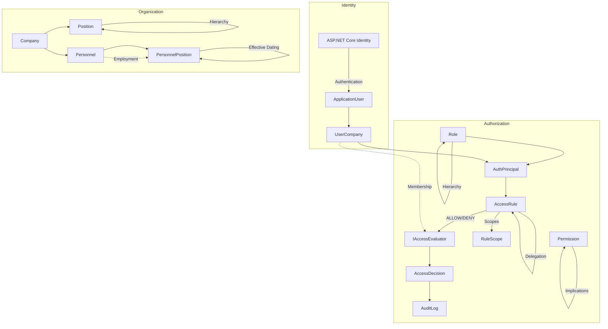
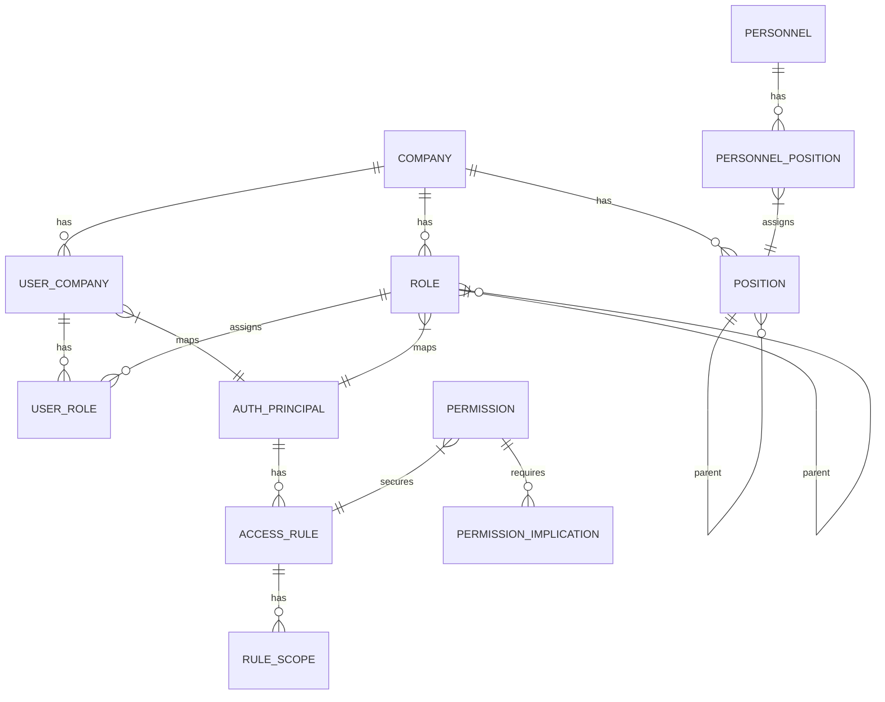

# Company Access Management

[](https://github.com/ArashAslani/company-user-access-management/actions/workflows/build.yml)

A multi-company **Organization, Identity & Authorization** backend built with **ASP.NET Core 10** and **Clean Architecture**, featuring hierarchical roles, scoped permissions, explicit DENY rules, delegation, and auditable access decisions.

## Why This Project Exists

Most enterprise applications need to manage **who can do what** across multiple companies or tenants. This project demonstrates a production-oriented backend that cleanly separates:

- **Identity** (authentication via ASP.NET Core Identity) — *who you are*
- **Organization** (companies, positions, personnel, effective dating) — *where you work*
- **Authorization** (roles, permissions, scopes, delegation, audit) — *what you can do*

Unlike simple RBAC, this system implements:
- Hierarchical roles with **Role Up** (inherit ancestor permissions) and **Role Down** (DENY propagates to descendants)
- **Branch-local DENY** — a DENY on one role branch doesn't kill ALLOW on another
- **Permission prerequisites** (e.g., `Edit` requires `Read`)
- **Scope-aware** permissions (`NONE` / `SELECTED` / `ALL`)
- **Delegation** with expiry and revocation
- **Super Admin** boundaries (Company / Global)

## Key Capabilities

| Area | Features |
|------|----------|
| **Multi-company** | Complete isolation; `UserCompany` membership required for any access |
| **Hierarchical Roles** | Parent/child roles; Role Up (allow), Role Down (deny boundary) |
| **Explicit DENY** | DENY always wins; branch-local; future descendants blocked |
| **Prerequisite Gates** | `Edit` → `Read`; DENY on prerequisite blocks stronger permission |
| **Scopes** | `NONE` (no scope), `SELECTED` (workshop A), `ALL` (any scope) |
| **Delegation** | Time-bounded; auto-revoked on source loss |
| **Super Admins** | Company & Global; bypass all checks |
| **Audit** | Every access decision logged with source trace |
| **Organization** | Position hierarchy, personnel, effective dating (`EffectiveFrom`/`EffectiveTo`) |
| **Position ≠ Role** | Employment ≠ System access; no auto-conversion |

## Architecture



## Core Domain Model



## Authorization Decision Model

```
User → UserCompany (membership)
      → Direct AccessRules
      → Roles (UserRole → AuthPrincipal → AccessRules)
          → Role Up (ancestors allow)
          → Role Down (descendants blocked by DENY)
      → Delegations (time-bounded, revocable)
      → DENY boundary (explicit DENY wins)
      → Prerequisite gates (Edit→Read)
      → Scope match (NONE/SELECTED/ALL)
      → Super Admin (Company/Global)
      → AccessDecision { Allowed, ReasonCode, Sources[] }
```

## Technology Stack

- **ASP.NET Core 10** — Web API
- **Entity Framework Core 10** — ORM with SQLite
- **MediatR** — CQRS (commands/queries)
- **AutoMapper** — DTO mapping
- **FluentValidation** — Request validation
- **ASP.NET Core Identity** — Authentication only
- **Scalar** — OpenAPI/Swagger UI
- **NUnit / Moq** — Testing
- **GitHub Actions** — CI

## Running Locally

```bash
# 1. Clone
git clone https://github.com/ArashAslani/company-user-access-management.git
cd company-user-access-management

# 2. Restore & Build
dotnet restore
dotnet build

# 3. Run (SQLite database auto-created via EF Core migrations)
dotnet run --project src/Web

# 4. Explore API
# Open http://localhost:5000/scalar for Scalar UI
```

### Database Initialization

- Uses **EF Core migrations** (`src/Infrastructure/Data/Migrations`)
- On first run in Development: `Database.MigrateAsync()` applies migrations + seeds QC application, permissions, implications
- No `EnsureDeleted`/`EnsureCreated` — safe for production
- Seed data: QC app, resources (Products, Laboratory, NCR, Organization, AccessManagement), permission implications (`Edit` → `Read`)

## API Exploration

- **Scalar UI**: `http://localhost:5000/scalar`
- **OpenAPI JSON**: `http://localhost:5000/openapi/v1.json`

### Key Endpoints

| Area | Endpoints |
|------|-----------|
| **Authorization** | `GET/POST /api/v1/access-control/roles`, `GET /api/v1/access-control/roles/tree`, `PUT /api/v1/access-control/roles/{id}/permissions`, `POST /api/v1/access-control/roles/bulk-assign` |
| **Scopes** | `GET /api/v1/access-control/scopes/workshops`, `GET /api/v1/access-control/scopes/resources/tree` |
| **Audit** | `GET /api/v1/audit/access-history`, `GET /api/v1/audit/access-history/export` |
| **Positions** | `GET/POST/PUT/DELETE /api/v1/organization/positions`, `GET /api/v1/organization/positions/tree` |
| **Personnel** | `GET/POST/PUT/DELETE /api/v1/organization/personnel`, `POST /api/v1/organization/personnel/{id}/positions` |
| **Attachments** | `POST /api/v1/attachments` |

## Demo Scenario

```bash
# 1. Register user
POST /api/v1/identity/register { email, password }

# 2. Login
POST /api/v1/identity/login { username, password }

# 3. Select company (sets workspace context)
POST /api/v1/workspace/select-company { companyId }

# 4. Create role
POST /api/v1/access-control/roles { companyId, code: "EDITOR", name: "Editor" }

# 5. Grant permission to role
PUT /api/v1/access-control/roles/{roleId}/permissions 
  { roleId, permissions: [{ permissionId: "Products.Read" }] }

# 6. Assign role to user (bulk)
POST /api/v1/access-control/roles/bulk-assign 
  { roleId, userCompanyIds: [...] }

# 7. Evaluate access (via authorization middleware on protected endpoints)
# Or call IAccessEvaluator directly:
var decision = await accessEvaluator.EvaluateAsync(new AccessRequest(
  UserId, CompanyId, "QC", "Products.Read", null, null));

# 8. Add explicit DENY on same role/permission
# Observe: decision.Allowed = false, ReasonCode = "DENIED_EXPLICIT_DENY"
```

## Testing

```bash
# All tests
dotnet test

# Authorization integration tests (11 scenarios)
dotnet test tests/Infrastructure.IntegrationTests/

# Test coverage includes:
# - Company isolation (A ≠ B)
# - Multiple role union
# - Self DENY blocks
# - Ancestor DENY blocks descendants
# - Branch-local DENY
# - Permission prerequisites (Edit→Read)
# - Direct user grants
# - Delegation expiration
# - Company/Global Super Admin
# - Scope NONE/SELECTED/ALL behavior
```

## Architecture Decisions

See [docs/decisions/](docs/decisions/) for ADRs:

- [ADR-0001](docs/decisions/ADR-001-Use-EFCore-In-Application-Layer.md) — EF Core in Application layer
- [ADR-0002](docs/decisions/ADR-002-Aspire-For-Orchestration-And-Testing.md) — Aspire for orchestration
- [ADR-0003](docs/decisions/ADR-003-MediatR-Contracts-In-Domain.md) — MediatR contracts in Domain
- **ADR-0004** — RoleGroup removal + PersonnelPosition effective dating (Accepted)

## Interesting Engineering Decisions

| Decision | Rationale |
|----------|-----------|
| **Identity roles ≠ Business roles** | ASP.NET Identity handles authN only; business roles live in `Role` entity |
| **Position ≠ Role** | Employment (PersonnelPosition) is independent of system access (Role/AccessRule) |
| **Branch-local DENY** | DENY on one role branch doesn't kill ALLOW on sibling branch |
| **Permission prerequisites** | `Edit` requires `Read`; evaluated at authorization time |
| **Effective dating** | `IsCurrentlyEffective = Active ∧ From ≤ now ∧ (To == null ∨ To > now)` — derived, not stored |
| **Fail-closed scopes** | `SELECTED` with no scope in request = DENY; `NONE` with scope = DENY |
| **Auditable sources** | Every `AccessDecision` includes `AccessSource[]` tracing origin |

## Origins / Attribution

This solution was **bootstrapped using Jason Taylor's Clean Architecture Solution Template** (v10.0) and then substantially adapted for the Company Access Management domain:

- Removed template sample features (Todo, WeatherForecast, Colour)
- Removed SPA frontends (Angular/React)
- Removed template packaging, test-templates CI, CodeQL
- Renamed `CleanArchitecture.*` → `CompanyAccessManagement.*`
- Implemented domain: Organization (Company/Position/Personnel), Identity (UserCompany), Authorization (Role/Permission/AccessRule/Delegation/Audit)
- Added ADR-0004: RoleGroup removal + PersonnelPosition effective dating

## License

MIT License — see [LICENSE](LICENSE)