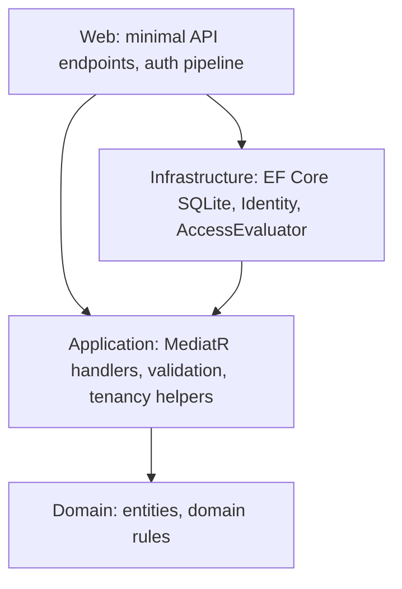
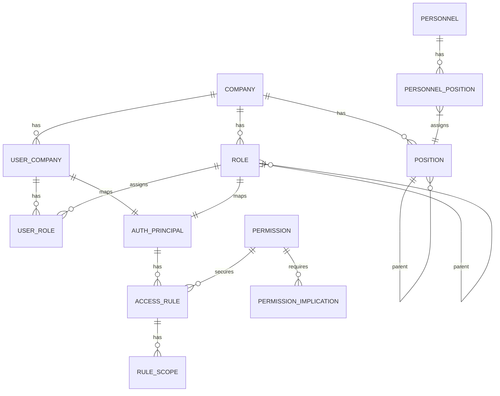

# Company Access Management

[](https://github.com/ArashAslani/company-user-access-management/actions/workflows/build.yml)

A portfolio / reference implementation of a multi-company **Organization, Identity & Authorization** backend. It is built with **ASP.NET Core 10**, **EF Core 10 on SQLite** and **Clean Architecture** as a modular monolith.

The goal is a small codebase whose behaviour is fully pinned by tests. It is not a production-hardened product. See [Known limitations](#known-limitations).

## What it does

It keeps three concerns separate:

- **Identity** (ASP.NET Core Identity, bearer tokens) answers *who you are*.
- **Organization** (companies, positions, personnel, effective-dated assignments) answers *where you work*.
- **Authorization** (roles, permissions, scopes, delegation) answers *what you can do*.

**Position ≠ Role.** Holding a position never grants system access by itself.

### Authorization semantics

These rules are recorded in [ADR-0005](docs/decisions/ADR-0005-Authorization-Evaluator-Semantics-And-Scope.md) and each one has a named test.

| Rule | Behaviour |
|---|---|
| Role Up | A user holding role R is allowed what R **or any descendant** of R allows. Ancestor ALLOWs are not inherited downward. |
| Role Down / DENY boundary | A DENY on any role between the origin role and R, or on any ancestor of R, blocks that branch. A shared ancestor's DENY blocks every branch beneath it. A sibling's DENY does not block another branch. |
| Direct user DENY | Global. It wins over every role branch and delegation, including a DENY on a prerequisite. |
| Prerequisites | For example, `Products.Edit` requires `Products.Read`. Prerequisites are evaluated recursively, and a prerequisite denied on the candidate's own path blocks it. |
| Validity | Inactive or expired roles grant nothing, but their DENYs still apply. Super-admin roles follow the same validity rules. |
| Scopes (fail-closed) | `None` matches only unscoped requests, `All` matches any scope, and `Selected` matches only an exact `(type, key)` pair. |
| Delegation | Valid only while the delegator is an active member of the same company and is still allowed the permission, not counting delegations. |
| Super admins | `CompanySuperAdmin` applies within its company; `GlobalSuperAdmin` applies across companies. These kinds cannot be created, edited or escalated to through the API. |

`IAccessEvaluator.EvaluateAsync` returns an `AccessDecision { Allowed, ReasonCode, Sources[] }`. `Sources` is a per-request **decision trace**: it records which rule and role produced the grant. It is **not** a persisted audit log. An `AuditLog` table exists in the schema, but nothing writes to it yet.

### Tenant isolation

Every business request carries `Authorization: Bearer <token>` and `X-Company-Id: <companyId>`.

- `WorkspaceContextMiddleware` accepts the header only for an active membership of that company.
- Handlers take the company from the workspace, never from the payload.

| Situation | Response |
|---|---|
| No or invalid token | 401 |
| Missing permission, or an `X-Company-Id` without an active membership | 403 |
| A body or query `companyId` that differs from the workspace | 403 |
| Another company's position, role, assignment or membership, referenced by id | 404 |
| A domain rule violation (overlap, cycle, duplicate code, sealed assignment, …) | 409, with a `code` in the ProblemDetails |

Personnel have no company of their own. A person is visible in a workspace when they hold an active assignment to one of its positions, or have no active assignment at all.

## Architecture


```mermaid
graph TD
    Web[Web: minimal API endpoints, auth pipeline] --> Infrastructure
    Web --> Application
    Infrastructure[Infrastructure: EF Core SQLite, Identity, AccessEvaluator] --> Application
    Application[Application: MediatR handlers, validation, tenancy helpers] --> Domain
    Domain[Domain: entities, domain rules]
```

`tests/ArchitectureTests` (NetArchTest) enforces these dependency rules:

- Domain references no Application, Infrastructure, Web, ASP.NET Core or EF Core.
- Application references no Infrastructure or Web.
- Infrastructure references no Web.

The request pipeline runs in this order:

1. `UseAuthentication`
2. `WorkspaceContextMiddleware` (resolves `X-Company-Id`)
3. `UseAuthorization`

On each endpoint, `RequirePermission("Resource.Action")` then calls the evaluator. The handler fails closed when the user, the workspace or the permission is missing.


```mermaid
erDiagram
    COMPANY ||--o{ USER_COMPANY : has
    COMPANY ||--o{ POSITION : has
    COMPANY ||--o{ ROLE : has
    POSITION ||--o{ POSITION : parent
    PERSONNEL ||--o{ PERSONNEL_POSITION : has
    PERSONNEL_POSITION }|--|| POSITION : assigns
    USER_COMPANY ||--o{ USER_ROLE : has
    ROLE ||--o{ USER_ROLE : assigns
    ROLE ||--o{ ROLE : parent
    USER_COMPANY ||--|| AUTH_PRINCIPAL : maps
    ROLE ||--|| AUTH_PRINCIPAL : maps
    AUTH_PRINCIPAL ||--o{ ACCESS_RULE : has
    ACCESS_RULE ||--o{ RULE_SCOPE : has
    PERMISSION ||--o{ ACCESS_RULE : secures
    PERMISSION ||--o{ PERMISSION_IMPLICATION : requires
```

The domain enforces the following rules:

- **Position and role hierarchies** reject cycles (409 `HIERARCHY_CYCLE`).
- **Personnel positions** are effective-dated: `IsCurrentlyEffective = Active ∧ From ≤ now ∧ (To = null ∨ To > now)`, derived at read time rather than stored.
- Overlapping assignments to the same position are rejected.
- At most one primary position per company may be effective at a time.
- Assignments whose effective window has ended are sealed.

## Running locally

```bash
git clone https://github.com/ArashAslani/company-user-access-management.git
cd company-user-access-management

dotnet restore
dotnet build
dotnet run --project src/Web      # http://localhost:5000, Scalar UI at /scalar
```

On startup in Development, the app applies EF Core migrations (never `EnsureCreated`) to `CompanyAccessManagement.db` and runs an idempotent seeder. The seeder creates:

- the `Administrator` identity role;
- the `administrator@localhost` / `Administrator1!` user;
- the `QC` application with its resources, permissions and prerequisites.

### Demo workspace (Development only)

`appsettings.Development.json` sets `Demo:Enabled=true`, which adds an idempotent demo workspace on top of the base seed. It never runs outside the Development environment, even if the flag is set elsewhere. It creates:

- `Demo Holding` (`d3e00000-0000-0000-0000-000000000001`) and, under it, `Demo Company` (`d3e00000-0000-0000-0000-000000000002`);
- a membership (`UserCompany` with its principal) for `administrator@localhost` in Demo Company;
- a root role `DEMO_ADMIN` holding every QC permission (`ScopeMode.All`), assigned to that membership.

With the flag off, the seed creates no companies or memberships and every business endpoint returns 403: there is no API for companies or memberships yet.

## API

| Area | Routes |
|---|---|
| Identity (ASP.NET Core Identity) | `POST /register`, `POST /login`, `POST /refresh`, `/manage/*`, … |
| Positions | `GET/POST /api/v1/organization/positions`, `GET/PUT/DELETE /api/v1/organization/positions/{id}`, `GET /api/v1/organization/positions/{id}/summary`, `GET /api/v1/organization/positions/tree?holdingId=` |
| Personnel | `GET/POST /api/v1/organization/personnel`, `GET/PUT/DELETE /api/v1/organization/personnel/{id}`, `POST /api/v1/organization/personnel/{id}/positions`, `PUT/DELETE /api/v1/organization/personnel/{personnelId}/positions/{assignmentId}`, `POST /api/v1/organization/personnel/{id}/signature` |
| Roles | `GET/POST /api/v1/access-control/roles`, `GET/PUT/DELETE /api/v1/access-control/roles/{id}`, `GET /api/v1/access-control/roles/tree?holdingId=`, `PUT /api/v1/access-control/roles/{id}/permissions`, `POST /api/v1/access-control/roles/{id}/permissions/copy-from`, `POST /api/v1/access-control/roles/bulk-assign` |
| Scopes | `GET /api/v1/access-control/scopes/resources/tree?applicationId=` |
| Docs | `GET /openapi/v1.json`, `GET /scalar` |

Permission names are canonical `Resource.Action` codes, e.g. `Organization.Position.Read` and `AccessManagement.Role.Permissions.Manage`. [`src/Web/Web-webapi.http`](src/Web/Web-webapi.http) contains ready-made requests.

```bash
# 1. Log in and keep the accessToken
curl -X POST http://localhost:5000/login -H "Content-Type: application/json" \
  -d '{"email":"administrator@localhost","password":"Administrator1!"}'

# 2. Call business endpoints in the demo company workspace
curl http://localhost:5000/api/v1/organization/positions \
  -H "Authorization: Bearer <accessToken>" -H "X-Company-Id: d3e00000-0000-0000-0000-000000000002"
curl http://localhost:5000/api/v1/access-control/roles \
  -H "Authorization: Bearer <accessToken>" -H "X-Company-Id: d3e00000-0000-0000-0000-000000000002"
```

## Testing

```bash
dotnet test CompanyAccessManagement.slnx
```

All tests run the real stack: migrations applied to a temporary file-backed SQLite database, with no EF InMemory provider. The API tests go through `WebApplicationFactory<Program>` with real Identity bearer tokens.

| Project | Tests | Covers |
|---|---|---|
| `tests/ArchitectureTests` | 3 | Layer dependency rules |
| `tests/Infrastructure.IntegrationTests` | 78 | Evaluator semantics (Role Up/Down, DENY boundaries, prerequisites, validity, delegation, super admins, scopes), organization domain rules, forward-migration data backfills, empty-database migration and seed-twice idempotency |
| `tests/Web.ApiIntegrationTests` | 86 | 401/403/2xx outcomes, the permission handler and CORS, tenant isolation (403/404), super-admin restrictions, role/position/personnel workflows, and the OpenAPI surface |

CI ([build.yml](.github/workflows/build.yml)) runs restore, a Release build and the full test suite on every push and pull request to `main`.

## Known limitations

- There is no API for companies, memberships or delegations; they are created through the data layer.
- The access decision trace is not persisted, and the `AuditLog` table is unused.
- The following are intentionally out of scope ([ADR-0005](docs/decisions/ADR-0005-Authorization-Evaluator-Semantics-And-Scope.md)):
  - a correction/versioning workflow for sealed assignments;
  - Workshop entities;
  - generic attachments;
  - a frontend.
- The evaluator loads the company's role graph for each request, with no caching.
- SQLite only.

## Architecture decisions

See [docs/decisions](docs/decisions/README.md) for the full index and the design documents.

- [ADR-001](docs/decisions/ADR-001-Use-EFCore-In-Application-Layer.md): EF Core in the Application layer
- [ADR-002](docs/decisions/ADR-002-Aspire-For-Orchestration-And-Testing.md): Aspire for local orchestration
- [ADR-003](docs/decisions/ADR-003-MediatR-Contracts-In-Domain.md): MediatR contracts in Domain
- [ADR-0004](docs/decisions/ADR-0004-RoleGroup-Removal-PersonnelPosition-Effective-Dating.md): RoleGroup removal and PersonnelPosition effective dating
- [ADR-0005](docs/decisions/ADR-0005-Authorization-Evaluator-Semantics-And-Scope.md): Evaluator semantics, tenant isolation and scope

## Technology stack

- ASP.NET Core 10 minimal APIs, ASP.NET Core Identity (bearer tokens)
- EF Core 10 with SQLite and migrations
- MediatR, FluentValidation, AutoMapper, Ardalis.GuardClauses
- Scalar and OpenAPI
- NUnit, Shouldly and NetArchTest for testing
- GitHub Actions for CI

## Origins / Attribution

This solution was **bootstrapped from [Jason Taylor's Clean Architecture Solution Template](https://github.com/jasontaylordev/CleanArchitecture)** (v10.0) and then substantially adapted for the Company Access Management domain:

- Removed the template's sample features (Todo, WeatherForecast, Colour), SPA frontends, packaging, test-template CI and CodeQL.
- Renamed `CleanArchitecture.*` to `CompanyAccessManagement.*`.
- Implemented the Organization, Identity-membership and Authorization domains described above.

## License

MIT License. See [LICENSE](LICENSE).
