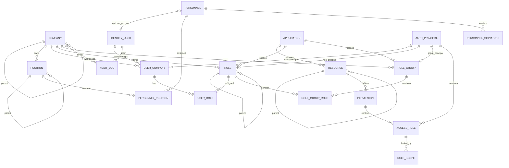

# سند طراحی قابل دفاع Identity + Organization + Authorization

**نسخه:** 3.0  
**وضعیت:** Defendable Architecture / Ready for Implementation Planning  
**دامنه:** Authentication، Account Management، چارت سازمانی، پرسنل، سمت‌ها، امضا، Role/Permission/Scope، Multi-Company  
**هدف:** طراحی ساده، قابل اعتماد، قابل تست و قابل توسعه که تمام سناریوهای فعلی را بدون ادغام اشتباه مفاهیم Identity، ساختار سازمانی و Authorization پوشش دهد.

---

# 0. Design Verdict

این طراحی برای نیازمندی‌های فعلی **قابل اجرا و قابل دفاع** است، با این تصمیم مرکزی:

> **Identity هویت و Authentication را مدیریت می‌کند؛ Organization واقعیت سازمانی افراد و سمت‌ها را نگه می‌دارد؛ Authorization تصمیم می‌گیرد چه کسی در چه Company/Application/Scope چه عملی را مجاز است انجام دهد.**

سه Boundary مستقل ولی متصل داریم:

```text
IDENTITY
ApplicationUser / Password / Login / Lockout / Tokens

ORGANIZATION
Personnel / Position / PersonnelPosition / PersonnelSignature

AUTHORIZATION
UserCompany / Role / RoleGroup / Permission / AccessRule / Scope
```

هیچ‌کدام جای دیگری را نمی‌گیرد.

این تفکیک برای صحت سیستم حیاتی است:

```text
Personnel ≠ ApplicationUser
Position  ≠ Role
PersonnelPosition ≠ UserCompany
Employment/Organization ≠ Authorization
Signature Image ≠ Cryptographic Digital Signature
```

---

# 1. اهداف قطعی طراحی

سیستم باید تمام موارد زیر را پشتیبانی کند:

- یک Account یکتا برای User؛
- ASP.NET Core Identity برای Authentication؛
- Account با یا بدون Personnel؛
- Personnel با یا بدون Account؛
- یک User در چند Company؛
- وضعیت مستقل Account و Company Membership؛
- Workspace در سطح Company؛
- چند Role همزمان در یک Company؛
- Role مستقل برای هر Company و Application؛
- Role hierarchy؛
- Role Up؛
- Role Down با DENY Boundary؛
- Direct User Permission؛
- Role Permission؛
- Role Group Permission؛
- Scope در سطح Action؛
- Delegation؛
- Company Super Admin و Global Super Admin؛
- مدیر محدود که فقط در subtree و در محدوده اختیار خودش Grant/Revoke می‌کند؛
- Audit Before/After/Actor/Source/Scope؛
- چند Application مستقل؛
- چارت سازمانی Company → Position → Personnel؛
- چند Position برای یک Personnel؛
- چند Root Position برای هر Company؛
- جلوگیری از loop در Position hierarchy؛
- نگهداری نسخه‌های امضای Personnel؛
- استفاده قابل اعتماد از امضا در Workflowهای تاریخی؛
- استفاده Position برای Routing سازمانی بدون تبدیل خودکار آن به Permission؛
- امکان استفاده آینده به‌عنوان سرویس مرکزی Authentication/Authorization بدون وابستگی Authorization به جداول داخلی QC.

---

# 2. اصل اول — کمترین Source of Truth ممکن

برای هر مفهوم فقط یک Source of Truth داریم.

| مفهوم | Source of Truth |
|---|---|
| Account / Password | ASP.NET Core Identity / `ApplicationUser` |
| Company hierarchy | `Company` |
| عضویت User در Company | `UserCompany` |
| ساختار سازمانی | `Position` |
| فرد سازمانی | `Personnel` |
| انتساب فرد به سمت | `PersonnelPosition` |
| نسخه‌های تصویر امضا | `PersonnelSignature` |
| Role امنیتی | `Role` |
| Permission Catalog | `Permission` |
| Allow / Deny / Delegation | `AccessRule` |
| Scope | `RuleScope` |
| Effective Access | **Derived in Authorization Engine** |
| تاریخچه تغییر | `AuditLog` |

موارد Derived در جدول مستقل تکرار نمی‌شوند.

---

# 3. اصل دوم — Authentication، Organization و Authorization یکی نیستند

## 3.1 Authentication

پاسخ می‌دهد:

```text
این شخص چه Accountی دارد؟
آیا Login معتبر است؟
Password معتبر است؟
Account فعال است؟
```

مالک اصلی:

```text
ASP.NET Core Identity
```

## 3.2 Organization

پاسخ می‌دهد:

```text
این شخص در سازمان چه کسی است؟
چه سمت‌هایی دارد؟
سمت بالادستی چیست؟
در چارت کجا قرار دارد؟
امضای ثبت‌شده او چیست؟
```

## 3.3 Authorization

پاسخ می‌دهد:

```text
این User در Company B و Application QC
روی Resource Products
در Workshop C
اجازه Read/Edit دارد یا خیر؟
```

این سه سؤال متفاوت‌اند و نباید با یک جدول یا یک Role مشترک جواب داده شوند.

---

# 4. تصمیم قطعی ASP.NET Core Identity — Option A

از ASP.NET Core Identity فقط برای Account/Authentication استفاده می‌کنیم.

```text
ApplicationUser : IdentityUser<Guid>
```

Roleهای تجاری داخل Identity Role subsystem قرار نمی‌گیرند.

بنابراین:

```text
AspNetUsers             = استفاده می‌شود
Identity User Claims    = در صورت نیاز Identity/Session only
Identity Logins/Tokens  = استفاده می‌شوند

AspNetRoles             = Business Role نیست
AspNetUserRoles         = Business UserRole نیست
AspNetRoleClaims        = Permission Store نیست
```

Business Authorization مدل مستقل خودش را دارد.

این انتخاب عمداً انجام شده چون Role تجاری ما فقط یک نام Role نیست و دارای موارد زیر است:

- Company؛
- Application؛
- Parent Role؛
- Role hierarchy؛
- Role Up/Down؛
- Role Group؛
- Scope؛
- DENY؛
- Delegation؛
- Administrative Authority؛
- Audit.

مدل ساده Role/Claim در Identity نباید به زور حامل این semantics شود.

---

# 5. مدل Account

## 5.1 ApplicationUser

فیلدهای Custom حداقلی روی Identity User:

```text
ApplicationUser
--------------------------------
Id                    PK
UserName              Identity
NormalizedUserName    Identity
PasswordHash          Identity
SecurityStamp         Identity
ConcurrencyStamp      Identity
PhoneNumber           Identity optional
PersonnelId           nullable
IsActive              bool
IsDeleted             bool
DeletedAt             nullable
```

`ApplicationUser` همان `AspNetUsers` است؛ جدول User دوم نداریم.

## 5.2 Personnel link اختیاری است

دو حالت معتبر:

```text
ApplicationUser -> Personnel
ApplicationUser -> null
```

و همچنین:

```text
Personnel -> ApplicationUser
Personnel -> no Account
```

Account شرط وجود Personnel نیست و Personnel نیز شرط ساخت Account نیست.

## 5.3 قاعده یکتایی Account برای Personnel

برای سادگی و جلوگیری از چند هویت موازی:

> یک Personnel در هر لحظه فقط یک Account غیرحذف‌شده قابل استفاده دارد.

در صورت غیرفعال شدن Account، همان Account باید قابل re-activate باشد و ایجاد Account دوم راه‌حل عادی نیست.

این Rule بهتر است علاوه بر Application Service با Unique/Filtered Index متناسب با DB provider محافظت شود.

---

# 6. Password، Lockout و Account Status

Password فقط توسط ASP.NET Core Identity مدیریت می‌شود.

DB نباید ستون‌های زیر داشته باشد:

```text
Password
ConfirmPassword
```

`ConfirmPassword` فقط DTO/UI validation است.

`IsActive` با Identity Lockout متفاوت است:

```text
IsActive=false
=> Business deactivation
=> Login جدید ممنوع

Lockout
=> Authentication security mechanism
=> ممکن است موقت باشد
```

هر دو باید مستقل باقی بمانند.

PasswordHash یا Security secret هرگز وارد Audit Before/After نمی‌شود.

---

# 7. Company hierarchy

Holding جدول مستقل ندارد.

ساختار:

```text
Company
--------------------------------
Id
ParentCompanyId nullable
Code
Name
AuthorizationRevision
Status
```

Root Company همان Holding است.

مثال:

```text
Root Holding
├── Company A
├── Company B
└── Company C
```

Position و Role هر دو به Company متصل می‌شوند ولی دو hierarchy مستقل دارند.

---

# 8. Workspace و Multi-Company

Workspace Entity مستقل نیست.

```text
Workspace = Active Company Authorization Context
```

Truth عضویت:

```text
UserCompany
```

ساختار:

```text
UserCompany
--------------------------------
Id
UserId
CompanyId
PrincipalId
Status
AuthorizationRevision
```

Constraint:

```text
UNIQUE(UserId, CompanyId)
```

User یک بار Login می‌کند و سپس فقط بین Companyهای Active خودش Switch می‌کند.

Role Switch وجود ندارد.

---

# 9. مدل Organization

Organization Core فقط چهار Entity جدید نیاز دارد:

```text
Personnel
Position
PersonnelPosition
PersonnelSignature
```

چارت سازمانی Entity جداگانه ندارد.

چارت از ترکیب موارد زیر ساخته می‌شود:

```text
Company.ParentCompanyId
Position.ParentPositionId
PersonnelPosition
```

---

# 10. Position — سمت سازمانی

## 10.1 ساختار

```text
Position
--------------------------------
Id                  PK
CompanyId            FK
ParentPositionId      FK nullable
Code                  required
Title                 required
Description           nullable
Status                ACTIVE / INACTIVE
ConcurrencyToken      optional
```

## 10.2 قواعد

- Position همیشه متعلق به یک Company است.
- Parent اختیاری است.
- Parent فقط می‌تواند Position همان Company باشد.
- چند Root در یک Company مجاز است.
- Position نمی‌تواند Parent خودش باشد.
- Position نمی‌تواند descendant خودش را Parent قرار دهد.
- تغییر Parent باید cycle-safe باشد.
- Position غیرفعال برای Assignment جدید قابل انتخاب نیست.

Business Code پیشنهادی:

```text
UNIQUE(CompanyId, Code)
```

`Id` همچنان شناسه globally unique فنی است.

اگر سازمان بعداً Business Code سراسری بخواهد، constraint می‌تواند بدون تغییر مدل مفهومی سخت‌تر شود.

---

# 11. چند Root Position

کاملاً معتبر است:

```text
Company A
├── هیئت مدیره
└── مدیرعامل
    ├── مدیر کیفیت
    └── مدیر تولید
```

هر دو Root:

```text
ParentPositionId = NULL
```

دارند.

نیازی به Root مصنوعی Position نداریم.

---

# 12. Position hierarchy و جلوگیری از Loop

Adjacency List استفاده می‌شود:

```text
Position.ParentPositionId
```

Closure Table در V1 نداریم.

قبل از Parent change:

```text
1. Parent exists
2. Parent.CompanyId == Position.CompanyId
3. Parent.Id != Position.Id
4. Parent is not descendant of Position
5. Commit atomically
```

برای جلوگیری از Race Condition دو تغییر همزمان hierarchy، عملیات Move Position باید Transactional باشد و حداقل یکی از الگوهای زیر استفاده شود:

- optimistic concurrency + retry؛ یا
- lock/advisory lock در سطح Company هنگام hierarchy mutation.

هدف این است که دو درخواست همزمان نتوانند با عبور از cycle-check جداگانه یک Cycle تولید کنند.

---

# 13. Personnel

## 13.1 ساختار

```text
Personnel
--------------------------------
Id                  PK
NationalCode         required
PersonnelCode        nullable
FirstName            required
LastName             required
PhoneNumber          nullable
Gender               MALE / FEMALE
Status               EMPLOYED / INACTIVE
ConcurrencyToken     optional
```

Constraint قطعی Story:

```text
UNIQUE(NationalCode)
```

`PersonnelCode` در Story به‌صورت optional آمده و یکتایی آن الزام نشده است؛ بنابراین بدون Business Decision جدید Unique نمی‌شود.

## 13.2 چرا Personnel.CompanyId نداریم؟

Company از Position Assignment به دست می‌آید:

```text
Personnel
  -> PersonnelPosition
      -> Position
          -> Company
```

ذخیره همزمان `Personnel.CompanyId` و `Position.CompanyId` دو Source of Truth ایجاد می‌کند.

مدل فعلی بدون جدول یا ستون اضافه حتی اجازه می‌دهد یک Personnel در صورت نیاز آینده در چند Company Position داشته باشد.

---

# 14. PersonnelPosition — انتساب Personnel به سمت

رابطه M:N است.

```text
PersonnelPosition
--------------------------------
PersonnelId          FK
PositionId           FK
IsPrimary            bool
Status               ACTIVE / INACTIVE
AssignedAt           datetime
EndedAt              nullable
```

Constraint:

```text
UNIQUE(PersonnelId, PositionId)
```

یک Personnel می‌تواند چند Position داشته باشد.

مثال:

```text
Ali
├── مدیر کیفیت
└── سرپرست آزمایشگاه
```

## 14.1 Primary Position

Story در لیست Personnel مفهوم «سمت اصلی» دارد.

برای Multi-Company، قاعده مناسب:

> در هر Company حداکثر یک Position فعال می‌تواند برای Personnel به‌عنوان Primary انتخاب شود.

به دلیل اینکه Company از Position به دست می‌آید، این invariant در Application Layer enforce می‌شود.

اگر DB provider و Query pattern آینده نیاز داشته باشد، می‌توان Read Model یا denormalized constraint اضافه کرد؛ در V1 نیازی نیست CompanyId در `PersonnelPosition` duplicate شود.

## 14.2 حداقل یک Position

Personnel با وضعیت `EMPLOYED` باید حداقل یک `PersonnelPosition` فعال داشته باشد.

ایجاد Personnel و اولین Position Assignment در یک Transaction انجام می‌شود.

Personnel غیرفعال می‌تواند هیچ Position فعال نداشته باشد.

---

# 15. Position Deactivation

Deactivation نباید silently assignmentهای فعال را نابود کند.

قاعده پیشنهادی برای رفتار قابل اعتماد:

```text
اگر Position دارای PersonnelPosition ACTIVE باشد:
    DeactivatePosition ساده => reject
```

Admin باید یکی از این کارها را صریح انجام دهد:

- Personnelها را Reassign کند؛
- Assignmentها را End/Inactive کند؛
- یا Command مدیریتی صریح برای Deactivate همراه با مدیریت assignmentها اجرا کند.

هیچ Cascade مخفی مجاز نیست.

این تصمیم جلوی ناپدید شدن افراد از ساختار سازمانی بدون Audit را می‌گیرد.

---

# 16. Org Chart

جدول `OrganizationChart` نداریم.

Read Model چارت:

```text
Company tree
   ↓
Position roots per company
   ↓
Position children
   ↓
Active PersonnelPosition
   ↓
Personnel
```

Zoom، Collapse، Expand، Search، Highlight و Cards concernهای UI/Query هستند، نه Entityهای persistence.

Queryهای اصلی:

- Positions by Company;
- Root Positions;
- Children by ParentPositionId;
- Personnel count per Position;
- Personnel by Position;
- search Position title/code;
- search Personnel name/national code.

---

# 17. Position با Role یکی نیست

این یکی از حیاتی‌ترین Invariantهای کل معماری است.

```text
Position
= Organizational responsibility

Role
= Security authority
```

ممکن است هر دو نام مشابه داشته باشند:

```text
Position: مدیر کیفیت
Role: QC Manager
```

اما Entity مشترک نیستند.

دلایل:

1. تغییر HR نباید خودکار Permission امنیتی ایجاد کند.
2. Role دارای Role Up/Down و DENY است ولی Position ندارد.
3. Role Application-specific است ولی Position سازمانی است.
4. یک Position ممکن است در چند Application نیاز به Roleهای متفاوت داشته باشد.
5. یک User ممکن است Direct Permission داشته باشد بدون تغییر Position.
6. Workflow routing و Authorization دو مسئله متفاوت‌اند.

---

# 18. Position به صورت خودکار Role نمی‌دهد

در V3 هیچ Rule خودکاری از نوع زیر وجود ندارد:

```text
Personnel assigned to Position X
=> automatically assign Role Y
```

Assignment امنیتی همچنان فقط توسط Authorization Management انجام می‌شود.

اگر در آینده Business صریحاً Auto-Provisioning بخواهد، قابلیت جداگانه‌ای مثل `PositionRolePolicy` می‌تواند طراحی شود؛ تا آن زمان اضافه کردن آن فقط Coupling و ریسک امنیتی ایجاد می‌کند.

---

# 19. PersonnelPosition با UserCompany یکی نیست

```text
PersonnelPosition
= Employment / Organization truth

UserCompany
= Allowed workspace membership
```

داشتن Position در Company B به‌تنهایی نباید `UserCompany(B)` بسازد.

و حذف Position نیز نباید خودکار UserCompany را حذف کند.

قانون:

> **Employment ≠ System Access**

اگر سازمان در آینده Deprovisioning خودکار HR→Access بخواهد، باید از یک Orchestration صریح، Transactional/Outbox-based و Audit‌شده استفاده شود، نه FK Cascade یا Side Effect پنهان.

---

# 20. Role مدل Authorization

ساختار:

```text
Role
--------------------------------
Id
CompanyId
ApplicationId
ParentRoleId nullable
PrincipalId
Name
RoleKind
ValidUntil nullable
Status
```

Parent فقط Same Company + Same Application.

Roleهای Companyهای مختلف حتی با نام برابر Entityهای مستقل‌اند.

---

# 21. Multiple Roles

User می‌تواند در یک Company چند Role همزمان داشته باشد:

```text
UserCompany
├── UserRole -> QC Expert
└── UserRole -> Laboratory Expert
```

Effective Access حاصل Union branchهای مستقل است.

Role Switch نداریم.

---

# 22. Role Group

RoleGroup Principal مستقل است و AccessRule خودش را دارد.

```text
Role A
├── Group 1
└── Group 2
```

Permissionهای RoleGroup داخل Role کپی نمی‌شوند.

Sourceها مستقل باقی می‌مانند:

```text
DIRECT_USER
ROLE
ROLE_GROUP
DELEGATED
```

---

# 23. Permission Catalog

Permission اتمیک است:

```text
Resource + Action
```

مثال:

```text
Products.Read
Products.Edit
Products.Delete
Laboratory.Read
Laboratory.Approve
Organization.Position.Read
Organization.Position.Manage
Organization.Personnel.Read
Organization.Personnel.Manage
Organization.Signature.Read
Organization.Signature.Manage
```

Constraint:

```text
UNIQUE(ResourceId, ActionCode)
```

Permission Catalog توسط Application capability تعریف می‌شود؛ Admin Business فقط Assignment را مدیریت می‌کند.

---

# 24. AccessRule

تمام Allow، Deny و Delegation از یک مدل واحد استفاده می‌کنند:

```text
AccessRule
--------------------------------
Id
PrincipalId
PermissionId
AuthorityRoleId nullable
DelegatedFromUserId nullable
Effect            ALLOW / DENY
Origin            MANUAL / DELEGATED / SYSTEM / COPY
ScopeMode         NONE / SELECTED / ALL
ValidFrom         nullable
ValidUntil        nullable
Status
```

## 24.1 ScopeMode fail-closed

DB:

```sql
scope_mode varchar(16) NOT NULL DEFAULT 'NONE'
CHECK (scope_mode IN ('NONE','SELECTED','ALL'))
```

معانی:

```text
NONE      => no effective scoped access
SELECTED  => only RuleScope rows
ALL       => explicit all allowed scope
```

Empty/NULL هرگز `ALL` نیست.

---

# 25. RuleScope

```text
RuleScope
--------------------------------
Id
AccessRuleId
ScopeType
ScopeKey
```

مثال:

```text
WORKSHOP | C
WORKSHOP | D
SITE | 10
PRODUCT_CATEGORY | 500
```

Authorization DB مالک Workshop/Site/Product نیست.

Scope validity توسط Application-specific `ScopeResolver` بررسی می‌شود.

---

# 26. سناریوی Workshop C / D

نیاز:

```text
User A / Company B

Workshop C:
Read = YES
Edit = NO

Workshop D:
Read = YES
Edit = YES
```

ذخیره:

```text
ALLOW Products.Read @ Workshop-C
ALLOW Products.Edit @ Workshop-D
```

Policy:

```text
Edit => Read
```

نتیجه:

```text
Workshop-C = Read
Workshop-D = Read + Edit
```

بدون duplicate permission.

---

# 27. Action implication و DENY

`Edit => Read` فقط Policy runtime است.

قاعده امنیتی:

```text
DENY Read
=> actions requiring Read are ineffective in same source/branch
```

پس:

```text
DENY  Products.Read @ D
ALLOW Products.Edit @ D
```

نتیجه:

```text
Read = false
Edit = false
```

Implication نباید fallback عمومی بعد از DENY باشد.

---

# 28. Role Up

اگر Role پایین در یک branch Allow مؤثر داشته باشد، ancestorهای همان branch آن Allow را Effective دارند.

```text
A
└── B
    └── C
        └── D
```

اگر D:

```text
ALLOW Products.Edit @ Workshop-D
```

داشته باشد، C/B/A نیز Effective هستند، مشروط به اینکه در مسیر DENY وجود نداشته باشد.

هیچ Permissionای روی ancestors کپی نمی‌شود.

---

# 29. Role Down

Revoke از Role بالاتر با DENY Boundary مدل می‌شود.

اگر روی B:

```text
DENY Products.Edit @ Workshop-C
```

ثبت شود:

- B Block می‌شود؛
- تمام descendants Block می‌شوند؛
- Role آینده زیر B نیز Block است؛
- داده descendants حذف نمی‌شود؛
- Audit علت Block را حفظ می‌کند.

تعریف دقیق:

```text
DENY path includes self + every ancestor/path node up to permission origin/consumer boundary.
```

خود Role هرگز از DENY خودش مستثنا نیست.

---

# 30. Multiple Roles و DENY

DENY branch-local است.

```text
User X
├── Role A -> DENY Products.Edit
└── Role B -> ALLOW Products.Edit
```

اگر B branch مستقل باشد:

```text
Effective Edit = YES
```

DENY Role A، Source مستقل Role B یا Direct User را به‌صورت جهانی نابود نمی‌کند.

این رفتار برای چند Job Code ضروری است.

---

# 31. Super Admin

## Company Super Admin

```text
RoleKind = COMPANY_SUPER_ADMIN
```

Policy:

```text
All Resources / Actions / Scopes
only within own Company
```

## Global Super Admin

فقط در Root Company قابل تعریف است:

```text
RoleKind = GLOBAL_SUPER_ADMIN
```

Policy:

```text
All Companies
All Applications
All Resources
All Actions
All Scopes
```

برای هیچ‌کدام هزاران AccessRule ساخته نمی‌شود.

تمام عملیات آنها Audit می‌شود.

---

# 32. Admin Authority

داشتن `Permission.Assign` به‌تنهایی کافی نیست.

برای Grant/Revoke عادی باید همه شروط برقرار باشد:

```text
1. Same Company
2. Target Role/User در subtree Role مدیریتی actor
3. همان Managing Role Permission موردنظر را Effective دارد
4. Requested Scope subset of ManagingRole Effective Scope
5. DENY آن Permission را روی branch Manager Block نکرده
6. Actor capability مدیریتی لازم را دارد
```

ممنوع:

```text
تجمیع Authority دو Role مختلف برای ساخت اختیار جدید
```

یعنی Role A نباید Permission بدهد و Role B Scope بدهد تا actor چیزی را Grant کند که هیچ Managing Role واحدی به‌تنهایی اختیارش را ندارد.

---

# 33. Delegation

Delegation همان AccessRule است:

```text
Origin = DELEGATED
DelegatedFromUserId = X
ValidUntil = ...
```

قواعد:

- Delegator اکنون Permission را واقعاً داشته باشد؛
- Delegated Scope subset باشد؛
- Delegation از مدت اعتبار منبع بیشتر نباشد؛
- اگر Delegator Permission را از دست داد، delegation Effective نباشد؛
- Re-delegation چندمرحله‌ای در V1 ممنوع است.

---

# 34. PersonnelSignature — مدل امضا

نیازمندی موجود یک **تصویر امضا** تعریف می‌کند، نه Digital Signature رمزنگاری‌شده.

بنابراین نام Domain باید دقیق باشد:

```text
PersonnelSignature
یا
SignatureImage
```

نباید ادعا شود که PKI/cryptographic digital signature پیاده‌سازی شده است.

یک Digital Signature واقعی طبق تعریف استاندارد مبتنی بر عملیات رمزنگاری و برای authenticity/integrity/non-repudiation است؛ PNG/JPG امضا این ویژگی را به‌خودی‌خود ایجاد نمی‌کند.

---

# 35. نسخه‌بندی امضا

Overwrite کردن یک تصویر روی `Personnel.Signature` ممنوع است.

مدل:

```text
PersonnelSignature
--------------------------------
Id                    PK
PersonnelId            FK
Version                 int
MimeType                varchar
SizeBytes               bigint
ContentHash             varchar
Content                 binary/blob
IsCurrent               bool
CreatedAt               datetime
CreatedByUserId         nullable FK
```

Constraints:

```text
UNIQUE(PersonnelId, Version)
At most one IsCurrent=true per Personnel
SizeBytes <= 8 MB
Allowed effective MIME = image/png | image/jpeg
```

Content نسخه ایجادشده immutable است.

در Replace:

```text
Old.IsCurrent = false
New row inserted with next Version and IsCurrent = true
```

این عملیات Transactional است.

---

# 36. چرا Signature Version لازم است؟

مثال:

```text
2026-09-01
Ali approves NCR with Signature v1

2026-10-01
Ali replaces signature with v2
```

فرم تاریخی 2026-09-01 باید همچنان v1 را نمایش دهد.

اگر consumer همیشه `CurrentSignature` را بخواند، سند تاریخی تغییر می‌کند که از نظر Audit غلط است.

پس Workflow/Approval باید در زمان ثبت Approval حداقل این اطلاعات را نگه دارد:

```text
ActorUserId
PersonnelId
PersonnelSignatureId
Decision
Timestamp
```

اگر سند نهایی باید کاملاً immutable باشد، consumer می‌تواند DisplayName/Position label مورد استفاده را نیز snapshot کند؛ این Snapshot متعلق به Workflow/Document domain است، نه Personnel master.

---

# 37. نبود امضا

Signature اجباری برای ساخت Personnel نیست.

اگر Current Signature وجود نداشته باشد:

```text
Personnel profile => warning
```

و هر Workflow step که Signature را required تعریف کرده باشد باید fail closed کند:

```text
SIGNATURE_REQUIRED
```

نباید یک placeholder image به‌عنوان امضای معتبر ذخیره یا مصرف شود.

---

# 38. امنیت Upload امضا

Requirement:

```text
PNG / JPG / JPEG
Max 8 MB
Stored in DB
```

کنترل Server-side باید حداقل شامل موارد زیر باشد:

1. extension allowlist؛
2. size limit؛
3. Content-Type صرفاً trusted نباشد؛
4. file signature/magic bytes بررسی شود؛
5. فایل واقعاً به‌عنوان image decode شود؛
6. ترجیحاً image decode/re-encode شود تا payload اضافی حذف شود؛
7. filename کاربر Source of Truth storage نباشد؛
8. retrieval فقط از authenticated/authorized endpoint؛
9. signature bytes در log/audit قرار نگیرد.

Storage در DB مطابق Story انجام می‌شود.

اگر در آینده حجم فایل‌ها باعث فشار جدی روی DB/Backup شد، storage abstraction می‌تواند بدون تغییر Domain Contract به Object Storage منتقل شود؛ V1 مطابق Requirement در DB می‌ماند.

---

# 39. مجوزهای Organization

Organization خارج از Authorization نیست؛ خودش Resource دارد.

مثال:

```text
Organization.Position.Read
Organization.Position.Create
Organization.Position.Edit
Organization.Position.Deactivate

Organization.Personnel.Read
Organization.Personnel.Create
Organization.Personnel.Edit
Organization.Personnel.Deactivate

Organization.PersonnelPosition.Assign
Organization.PersonnelPosition.Remove

Organization.Signature.Read
Organization.Signature.Upload
Organization.Signature.Replace

Organization.Chart.Read
```

این Permissionها از همان Authorization Engine عبور می‌کنند.

داشتن Position HR به خودی خود این Permissionها را نمی‌دهد.

---

# 40. Integration با Workflow

Workflow برای Routing سازمانی از Organization استفاده می‌کند.

مثال:

```text
Step target:
Company B + Position "Laboratory Manager"
```

Organization پاسخ می‌دهد:

```text
Personnelهای Active در آن Position
```

سپس Account link و Authorization بررسی می‌شود.

دو سؤال جدا:

```text
Who should receive the task?
=> Organization / Position

Who may perform the action?
=> Authorization / Permission
```

Workflow نباید صرفاً به دلیل Position، Authorization check را حذف کند.

---

# 41. Integration با Workshop — Gap صریح Requirement

نیازمندی می‌گوید:

```text
کارتابل بازرس: تخصیص تسک بر اساس سمت و کارگاه پرسنل
```

اما همین Story هیچ فیلدی برای:

```text
Personnel -> Workshop
Position -> Workshop
```

تعریف نکرده است.

بنابراین این طراحی عمداً **Workshop را از Permission Scope استنتاج نمی‌کند**.

چرا؟

```text
Access to Workshop C
!=
Organizational assignment to Workshop C
```

مجوز امنیتی با محل سازمانی کار یکی نیست.

Contract موردنیاز:

```text
IWorkAssignmentResolver
    ResolvePersonnel(company, position, workshop)
```

مالک داده باید Production Structure / HR Assignment module باشد.

اگر چنین مالکیتی در سیستم وجود ندارد، قبل از پیاده‌سازی سناریوی «Position + Workshop routing» یک Business Decision جدا برای `PersonnelWorkAssignment` لازم است.

تا آن تصمیم، هیچ جدول generic و مبهمی به Organization اضافه نمی‌شود.

---

# 42. Audit یکپارچه

از همان `AuditLog` مشترک استفاده می‌شود.

ساختار مفهومی:

```text
AuditLog
--------------------------------
Id
CompanyId nullable
ApplicationId nullable
ActorUserId
OperationId
EntityType
EntityId
TargetPrincipalId nullable
PermissionId nullable
SourceType
EventType
BeforeData
AfterData
Metadata
CreatedAt
```

Account یا Personnel eventهایی که هنوز Company مشخص ندارند می‌توانند `CompanyId=NULL` داشته باشند.

---

# 43. Organization Audit Events

حداقل:

```text
POSITION_CREATED
POSITION_UPDATED
POSITION_PARENT_CHANGED
POSITION_ACTIVATED
POSITION_DEACTIVATED

PERSONNEL_CREATED
PERSONNEL_UPDATED
PERSONNEL_STATUS_CHANGED

PERSONNEL_POSITION_ASSIGNED
PERSONNEL_POSITION_REMOVED
PRIMARY_POSITION_CHANGED

SIGNATURE_UPLOADED
SIGNATURE_REPLACED

PERSONNEL_ACCOUNT_LINKED
PERSONNEL_ACCOUNT_UNLINKED
```

Signature binary داخل Before/After ذخیره نمی‌شود.

برای Signature:

```text
OldSignatureId
NewSignatureId
OldHash
NewHash
```

کافی است.

---

# 44. Authorization Audit Events

همچنان شامل:

```text
ROLE_ASSIGNED
ROLE_REMOVED
ROLE_PARENT_CHANGED
ROLE_GROUP_MEMBERSHIP_CHANGED
PERMISSION_GRANTED
PERMISSION_DENIED
PERMISSION_REVOKED
SCOPE_CHANGED
PERMISSION_COPIED
DELEGATION_CREATED
DELEGATION_REVOKED
```

Before/After + Actor + Source + Scope حفظ می‌شوند.

---

# 45. OperationId

یک Command ممکن است چند Entity را تغییر دهد.

مثال Personnel creation:

```text
Create Personnel
+ Assign Position
+ Upload Signature
+ Link Account
```

اگر در یک Use Case انجام شود، Eventها با یک `OperationId` قابل گروه‌بندی هستند.

همین الگو برای Authorization نیز استفاده می‌شود.

---

# 46. Transaction Boundaries

تمام Mutationهای وابسته باید Atomic باشند.

نمونه‌ها:

```text
Create Personnel
+ first PersonnelPosition
+ Audit
```

```text
Replace Signature
+ old IsCurrent=false
+ new Signature row
+ Audit
```

```text
Move Position Parent
+ cycle check
+ parent update
+ Audit
```

```text
Grant Permission
+ RuleScope
+ Audit
+ Revision increment
```

یا همه Commit می‌شوند یا هیچ‌کدام.

---

# 47. ERD یکپارچه



نکته: `IDENTITY_USER` همان `ApplicationUser/AspNetUsers` است، نه جدول User دوم.

---

# 48. جدول‌های اصلی سیستم

## Identity Infrastructure

جداول داخلی Identity بر اساس نیاز framework؛ از جمله User/Login/Token/Claimهای هویتی.

Business Role/Permission در این جداول ذخیره نمی‌شود.

## Shared / Organization / Authorization Core

1. `Company`
2. `ApplicationUser` (همان Identity User)
3. `Personnel`
4. `Position`
5. `PersonnelPosition`
6. `PersonnelSignature`
7. `Application`
8. `UserCompany`
9. `Role`
10. `UserRole`
11. `RoleGroup`
12. `RoleGroupRole`
13. `AuthPrincipal`
14. `Resource`
15. `Permission`
16. `AccessRule`
17. `RuleScope`
18. `AuditLog`

Entityهای Derived مثل OrgChart یا EffectiveAccess جدول ندارند.

---

# 49. Constraintهای حیاتی DB

## ApplicationUser

```text
NormalizedUserName UNIQUE
PersonnelId optional
```

یک Personnel نباید دو Account non-deleted عملیاتی داشته باشد.

## Company

```text
ParentCompanyId != Id
```

## Position

```text
UNIQUE(CompanyId, Code)
ParentPositionId != Id
Parent must belong to same Company
```

Cycle در Transaction/Application check می‌شود.

## Personnel

```text
NationalCode UNIQUE
```

## PersonnelPosition

```text
UNIQUE(PersonnelId, PositionId)
```

Position جدید assignment باید Active باشد.

## PersonnelSignature

```text
UNIQUE(PersonnelId, Version)
At most one current version per Personnel
SizeBytes <= 8MB
```

## UserCompany

```text
UNIQUE(UserId, CompanyId)
PrincipalId UNIQUE NOT NULL
```

## Role

Parent:

```text
Same Company
Same Application
not self
no cycle
```

## UserRole

```text
UNIQUE(UserCompanyId, RoleId)
UserCompany.CompanyId == Role.CompanyId
```

## RoleGroupRole

```text
UNIQUE(RoleGroupId, RoleId)
Same Company
Same Application
```

## Permission

```text
UNIQUE(ResourceId, ActionCode)
```

## RuleScope

```text
UNIQUE(AccessRuleId, ScopeType, ScopeKey)
```

## AccessRule ScopeMode

```text
NOT NULL
DEFAULT NONE
CHECK NONE|SELECTED|ALL
```

---

# 50. Indexهای مهم

حداقل:

```text
Position(CompanyId, ParentPositionId, Status)
Position(CompanyId, Code)
Position(CompanyId, Title)

Personnel(NationalCode)
Personnel(LastName, FirstName)
Personnel(Status)

PersonnelPosition(PositionId, Status)
PersonnelPosition(PersonnelId, Status)

PersonnelSignature(PersonnelId, IsCurrent)

UserCompany(UserId, CompanyId)
Role(CompanyId, ApplicationId, ParentRoleId)
UserRole(UserCompanyId, RoleId)
RoleGroupRole(RoleId, RoleGroupId)
AccessRule(PrincipalId, PermissionId, Status)
AccessRule(PermissionId, Effect, Status)
RuleScope(ScopeType, ScopeKey, AccessRuleId)
AuditLog(CompanyId, CreatedAt)
AuditLog(ActorUserId, CreatedAt)
AuditLog(EntityType, EntityId, CreatedAt)
AuditLog(OperationId)
```

Search پیشرفته نام Personnel در صورت نیاز بعداً می‌تواند Full-Text/normalized search index بگیرد؛ برای V1 جدول اضافی لازم نیست.

---

# 51. Authentication Flow

```text
1. Find ApplicationUser
2. Ensure IsDeleted == false
3. Ensure IsActive == true
4. Validate password using ASP.NET Core Identity
5. Apply Identity lockout/security policies
6. Create authenticated session/token
7. Load ACTIVE UserCompany memberships
8. User selects allowed Company workspace
9. Server validates membership again
10. Authorization Engine evaluates access
```

Personnel یا Position شرط Login نیست.

---

# 52. Workspace Security

CompanyId دریافتی از Client به‌تنهایی trusted نیست.

برای هر Active Context:

```text
UserCompany(UserId, CompanyId) exists
AND Status == ACTIVE
```

سپس Authorization محاسبه می‌شود.

Cached ALLOW قبل از Account/Membership validation قابل استفاده نیست.

---

# 53. Effective Access

```text
EffectiveAccess =
    Direct User source
    UNION Role Branch 1
    UNION Role Branch 2...
    UNION RoleGroup contribution
    UNION valid Delegations
```

سپس:

```text
Role Up
Role Down DENY gates
Action implications
Scope containment
Super Admin policy
```

اعمال می‌شوند.

Position یا PersonnelPosition جزو فرمول Authorization نیستند.

---

# 54. Cache و Revision

Authorization Cache optimization است، Source of Truth نیست.

حداقل Revisionها:

```text
Company.AuthorizationRevision
UserCompany.AuthorizationRevision
Application.PolicyRevision
```

Cache key مفهومی:

```text
UserId
+ CompanyId
+ ApplicationId
+ revisions
```

هر Mutation مؤثر بر Authorization revision را در همان Transaction افزایش می‌دهد.

Eviction event برای سرعت خوب است ولی correctness نباید به رسیدن event وابسته باشد.

Cache با Revision نامعتبر نباید ALLOW تولید کند.

Organization tree cache در صورت نیاز مستقل است و نباید از `AuthorizationRevision` برای semantics HR سوءاستفاده کند.

---

# 55. Reportability

سیستم باید بتواند گزارش‌های زیر را بسازد:

## Authorization

```text
User X / Laboratory
Previous Role
New Role
Permission gained/lost
Source
Scope
Actor
Timestamp
```

## Organization

```text
Personnel X
Previous Position
New Position
Old Parent/New Parent
Primary Position change
Signature version change
Actor
Timestamp
```

Full EffectiveAccess Snapshot بعد از هر تغییر ذخیره نمی‌شود؛ Current State + immutable Audit Delta مبناست.

اگر Time-Travel reporting در آینده سنگین شد، Read Model جدا ساخته می‌شود.

---

# 56. سناریوهای دفاع — Identity / Account

| سناریو | پاسخ |
|---|---|
| یک Account، چند Company | `ApplicationUser + UserCompany` |
| Account بدون Personnel | بله |
| Personnel بدون Account | بله |
| یک Personnel با چند Account فعال | خیر |
| Password امن | Identity |
| Account inactive مانع Login | بله |
| Membership یک Company inactive بدون غیرفعال شدن Account | بله |
| Switch فقط Company | بله |
| Business Role خارج از AspNetRoles | بله |

---

# 57. سناریوهای دفاع — Organization

## O1 — Position به تفکیک Company

```text
Position.CompanyId
```

**YES**

## O2 — Holding همان Root Company

Company tree استفاده می‌شود و Holding table جدا نداریم.

**YES**

## O3 — چند Root Position در یک Company

`ParentPositionId=NULL` برای چند رکورد مجاز است.

**YES**

## O4 — Parent فقط همان Company

Validation + constraint/invariant.

**YES**

## O5 — جلوگیری از Loop

Transactional ancestor/descendant validation.

**YES**

## O6 — Personnel چند Position

`PersonnelPosition` M:N.

**YES**

## O7 — نمایش Personnel زیر Position در Chart

Query از `PersonnelPosition`.

**YES**

## O8 — سمت اصلی

`PersonnelPosition.IsPrimary` با حداکثر یک Primary فعال در هر Company.

**YES**

## O9 — Personnel inactive

Status مستقل؛ history/signatures حفظ می‌شوند.

**YES**

## O10 — امضا اختیاری

Personnel بدون Signature معتبر است ولی workflow requiring signature fail closed می‌کند.

**YES**

## O11 — Replace امضا بدون تغییر فرم‌های تاریخی

Versioned `PersonnelSignature` + workflow stores SignatureId.

**YES**

## O12 — امضا در DB

Content blob مطابق Requirement.

**YES**

## O13 — Chart بدون جدول اضافه

Derived Read Model.

**YES**

## O14 — تغییر Position به‌تنهایی Permission ندهد

Position و Role مستقل‌اند.

**YES**

## O15 — Personnel Position به‌تنهایی Workspace نسازد

PersonnelPosition و UserCompany مستقل‌اند.

**YES**

## O16 — Workflow بر اساس Position شخص را پیدا کند

Organization query/service.

**YES**

## O17 — Workflow هنوز Permission را بررسی کند

Authorization بعد از Routing اجباری است.

**YES**

## O18 — Position + Workshop Routing

Architecture integration point را پشتیبانی می‌کند، اما **داده Personnel↔Workshop در Story فعلی تعریف نشده** و باید توسط Work Assignment owner تأمین شود. Permission Scope جای آن را نمی‌گیرد.

**SUPPORTED WITH EXPLICIT EXTERNAL DEPENDENCY**

---

# 58. سناریوهای دفاع — Authorization

| سناریو | مکانیزم |
|---|---|
| Role جدا برای هر Company | `Role.CompanyId` |
| Role جدا برای هر Application | `Role.ApplicationId` |
| چند Role همزمان | `UserRole` + Union |
| Role Group Permission | RoleGroup Principal |
| Role عضو چند Group | M:N |
| Direct User Permission | UserCompany Principal |
| Source separation | Principal type + Audit |
| Role Up | runtime descendant aggregation |
| Role Down | DENY Boundary |
| خود Role توسط DENY خودش Block شود | Self included in path |
| Future descendant Block شود | ancestor DENY |
| DENY وسط مسیر Role Up leak ندهد | full path check |
| DENY branch دیگر را نابود نکند | branch-local evaluation |
| Read C / Edit D | atomic Permission + Scope |
| Edit=>Read | policy |
| DENY Read دور زده نشود | implication under same DENY gates |
| Company Super Admin | RoleKind policy |
| Global Super Admin | root RoleKind policy |
| Limited/Full IAM Admin | AccessManagement permissions |
| Manager فقط subtree خودش | role hierarchy |
| Manager فقط permission خودش | authority check |
| Manager فقط scope خودش | subset check |
| Authority دو Role ترکیب نشود | single ManagingRole rule |
| Delegation | AccessRule Origin=DELEGATED |
| Delegation بعد از فقدان منبع بی‌اثر | runtime ownership validation |
| Copy بدون dependency | command copies independent rules |
| Multi-Application | Application namespace |
| Central service readiness | external ScopeKey + resolvers |

---

# 59. ریسک‌ها و کنترل‌ها

## Risk 1 — Position و Role یکی شوند

**خطر:** تغییر HR باعث Permission ناخواسته شود.

**کنترل:** Entity و Service مستقل؛ هیچ FK خودکار Position→Role در V1.

## Risk 2 — PersonnelCompany duplicate truth

**خطر:** Company روی Personnel با Company Position تناقض پیدا کند.

**کنترل:** Company از Position Assignment مشتق می‌شود.

## Risk 3 — PersonnelPosition و UserCompany یکی شوند

**خطر:** صرف استخدام باعث دسترسی سیستم شود.

**کنترل:** Employment ≠ System Access.

## Risk 4 — Signature overwrite

**خطر:** اسناد تاریخی امضای جدید نشان دهند.

**کنترل:** نسخه‌بندی immutable content + Workflow stores SignatureId.

## Risk 5 — Uploaded image malicious باشد

**کنترل:** allowlist + size + MIME/magic + decode/re-encode + authorized endpoint.

## Risk 6 — Position hierarchy cycle

**کنترل:** transactional cycle check + concurrency control.

## Risk 7 — Position deactivate و افراد silently orphan شوند

**کنترل:** reject simple deactivation while active assignments exist.

## Risk 8 — Personnel inactive ولی Account فعال بماند

این یک inconsistency خودکار نیست؛ دو Domain مستقل‌اند.

**کنترل:** وضعیت‌ها مستقل‌اند. اگر Business خواهان auto-deprovision شد، orchestration صریح و audited تعریف می‌شود.

## Risk 9 — Workshop assignment از Permission Scope استنتاج شود

**خطر:** دسترسی امنیتی به‌اشتباه محل کار تلقی شود.

**کنترل:** Work Assignment source مستقل.

## Risk 10 — Business Role وارد Identity Claims شود

**خطر:** stale claims و دو Source of Truth.

**کنترل:** Option A؛ Permission Source of Truth فقط Authorization DB.

## Risk 11 — Cache stale بعد از Revoke

**کنترل:** Revision-keyed cache + DB fallback + post-commit eviction.

## Risk 12 — DENY روی خود Role نادیده گرفته شود

**کنترل:** Self + ancestor/path semantics صریح و Integration Test.

## Risk 13 — Edit implication DENY Read را دور بزند

**کنترل:** implication فقط داخل همان source/branch و زیر DENY gates.

---

# 60. ممنوعیت‌های پیاده‌سازی

1. `Position` و `Role` Merge نشوند.
2. Personnel Position خودکار Role نسازد.
3. Personnel Position خودکار UserCompany نسازد.
4. حذف Position به‌صورت cascade افراد را حذف نکند.
5. Signature current image روی یک blob ثابت overwrite نشود.
6. Signature image به‌عنوان cryptographic Digital Signature معرفی نشود.
7. Workshop assignment از Permission Scope استنتاج نشود.
8. Permission بین Role parent/child کپی نشود.
9. Role Up/Down با DB trigger پیاده‌سازی نشود.
10. Empty Scope به معنی ALL نباشد.
11. Direct/Role/RoleGroup sourceها merge فیزیکی نشوند.
12. EffectiveAccess Source of Truth ذخیره نشود.
13. Global Super Admin با هزاران Grant ساخته نشود.
14. Delegation بدون بررسی فعلی Delegator معتبر نباشد.
15. CompanyId ارسالی Client بدون Membership validation trusted نباشد.
16. Business permissions داخل JWT/Identity Claims به‌عنوان truth دائمی ذخیره نشوند.
17. PasswordHash/Signature Content وارد Audit JSON نشود.
18. UI به‌عنوان enforcement security trusted نباشد.

---

# 61. Acceptance Checklist — Organization

قبل از Production با Integration Test اثبات شود:

- [ ] Position فقط Parent همان Company را می‌پذیرد.
- [ ] Position نمی‌تواند Parent خودش شود.
- [ ] Position نمی‌تواند descendant خودش را Parent کند.
- [ ] concurrent parent changes قادر به ساخت cycle نیستند.
- [ ] Company می‌تواند چند Root Position داشته باشد.
- [ ] Code سمت در Company طبق constraint یکتا است.
- [ ] Personnel NationalCode duplicate رد می‌شود.
- [ ] Personnel EMPLOYED بدون Position فعال Commit نمی‌شود.
- [ ] Personnel می‌تواند چند Position داشته باشد.
- [ ] در هر Company بیش از یک Primary فعال برای Personnel ایجاد نمی‌شود.
- [ ] Position inactive برای Assignment جدید قابل انتخاب نیست.
- [ ] Position دارای Assignment فعال بدون remediation صریح deactivate نمی‌شود.
- [ ] Personnel بدون Account معتبر است.
- [ ] Account بدون Personnel معتبر است.
- [ ] Personnel دو Account non-deleted عملیاتی نمی‌گیرد.
- [ ] PersonnelPosition ساخت UserCompany نمی‌کند.
- [ ] Position Assignment ساخت UserRole نمی‌کند.
- [ ] OrgChart از Company/Position/PersonnelPosition تولید می‌شود.
- [ ] Search Position/Personnel روی داده master انجام می‌شود.
- [ ] Signature فقط PNG/JPEG معتبر را قبول می‌کند.
- [ ] فایل بیش از 8MB رد می‌شود.
- [ ] MIME header به‌تنهایی trusted نیست.
- [ ] Replace Signature یک Version جدید می‌سازد.
- [ ] فقط یک Current Signature وجود دارد.
- [ ] Approval قدیمی بعد از Replace همچنان SignatureId قدیمی را نمایش می‌دهد.
- [ ] Workflow requiring signature بدون current signature اجازه final approval نمی‌دهد.
- [ ] Signature content در Audit ذخیره نمی‌شود.
- [ ] Signature endpoint بدون Permission مناسب قابل دریافت نیست.
- [ ] Work assignment به Workshop از Permission Scope استنتاج نمی‌شود.

---

# 62. Acceptance Checklist — Identity / Authorization

- [ ] فقط یک ApplicationUser account truth وجود دارد.
- [ ] Account inactive Login را Block می‌کند.
- [ ] Membership inactive Workspace را Block می‌کند ولی Account را غیرفعال نمی‌کند.
- [ ] Role Company A به Company B leak نمی‌کند.
- [ ] Parent Role فقط same Company/Application است.
- [ ] User می‌تواند چند Role همزمان داشته باشد.
- [ ] Roleهای همان Company Union می‌شوند.
- [ ] Role Group مستقل می‌ماند.
- [ ] Role می‌تواند عضو چند Group باشد.
- [ ] Direct User Permission داخل Role کپی نمی‌شود.
- [ ] Permission descendant به ancestor Effective می‌رسد.
- [ ] DENY خود Role، همان Role را Block می‌کند.
- [ ] DENY parent تمام descendants را Block می‌کند.
- [ ] descendant Allow نمی‌تواند از DENY وسط مسیر عبور کند.
- [ ] Future Role زیر DENY محدود است.
- [ ] DENY یک branch، branch مستقل دیگر را Block نمی‌کند.
- [ ] DENY Read + ALLOW Edit در همان branch => Read=false, Edit=false.
- [ ] implication fallback عمومی وجود ندارد.
- [ ] Edit D باعث Edit C نمی‌شود.
- [ ] Company Super Admin فقط own company است.
- [ ] Global Super Admin cross-company است و Audit می‌شود.
- [ ] Manager sibling/ancestor را مدیریت نمی‌کند.
- [ ] Manager Permission نداشته را Grant نمی‌کند.
- [ ] Manager Scope خارج از Scope خودش Grant نمی‌کند.
- [ ] Authority دو Managing Role با هم ترکیب نمی‌شود.
- [ ] Delegation از منبع بزرگ‌تر نمی‌شود.
- [ ] از دست رفتن منبع Delegator، delegation را ineffective می‌کند.
- [ ] Audit Actor/Time/Before/After/Source/Scope دارد.
- [ ] Copy Source/Target dependency ایجاد نمی‌کند.
- [ ] ScopeMode null/empty به ALL تبدیل نمی‌شود.
- [ ] Cache revision قدیمی ALLOW تولید نمی‌کند.
- [ ] Account/Membership قبل از cached authorization بررسی می‌شوند.
- [ ] QC Permission به Application دیگر leak نمی‌کند.

---

# 63. Definition of Done معماری

## Identity

- ASP.NET Core Identity Account source of truth باشد.
- Password/Login/Lockout/SecurityStamp در Identity بماند.
- Business Role/Permission در Identity Role/Claims ذخیره نشود.

## Organization

- Personnel مستقل از Account باشد.
- Position مستقل از Role باشد.
- Position hierarchy cycle-safe باشد.
- Personnel multi-position پشتیبانی شود.
- Chart از داده master derive شود.
- Signature versioned باشد.
- Workflow historical signature قابل حفظ باشد.
- Position/Personnel mutation Audit شود.

## Authorization

- Company/Workspace isolation برقرار باشد.
- Role hierarchy و Role Up/Down تست شود.
- Scope fail closed باشد.
- Multiple Roles branch behavior تست شود.
- Admin authority محدود باشد.
- Delegation قابل revoke و قابل audit باشد.
- Cache correctness با Revision تضمین شود.

## Integration

- Workflow Routing و Authorization check جدا باشند.
- Signature Approval reference immutable باشد.
- Workshop routing مالک داده مشخص داشته باشد.
- هیچ Cross-boundary cascade مخفی وجود نداشته باشد.

---

# 64. چرا این معماری ساده است؟

سادگی به معنی حذف مفاهیم لازم نیست؛ به معنی حذف داده و coupling غیرضروری است.

این طراحی عمداً جدول اختصاصی برای موارد زیر ندارد:

```text
OrganizationChart
EffectiveAccess
InheritedPermission
RoleUpPermission
RoleDownPermission
SuperAdminPermission
DelegationPermission
PositionRoleAutoMapping
Workspace
CurrentSignatureSnapshot روی Personnel
```

چون این موارد یا Derived State هستند، یا Rule، یا متعلق به Consumer Domain.

فقط Facts پایدار ذخیره می‌شوند.

---

# 65. نقاط اصلی دفاع معماری

## 65.1 Single Account Truth

Identity User تنها Account است.

## 65.2 Single Organization Truth

Position/Personnel master مستقل از Permission است.

## 65.3 Single Authorization Truth

Business Permission فقط در Authorization مدل می‌شود.

## 65.4 No accidental privilege from HR changes

جابجایی Position مستقیماً Permission نمی‌سازد.

## 65.5 No accidental workspace from employment

سمت در Company خودکار workspace access نمی‌دهد.

## 65.6 Historical signature correctness

Approval به version مشخص Signature اشاره می‌کند.

## 65.7 No duplicate hierarchy data

Company/Position/Role همگی adjacency-list ساده دارند.

## 65.8 Fail Closed

Scope، signature-required workflow، cache uncertainty و authorization ambiguity دسترسی را باز نمی‌کنند.

## 65.9 Auditable

Mutationهای Identity-facing business state، Organization و Authorization قابل ردیابی هستند.

## 65.10 Evolvable

اگر بعداً Position→Role automation، PersonnelWorkAssignment، PKI Digital Signature یا Object Storage لازم شد، هرکدام می‌توانند به‌عنوان قابلیت مستقل اضافه شوند بدون شکستن core model.

---

# 66. پاسخ کوتاه برای جلسه دفاع

اگر پرسیده شود «چرا Position را Role نکردید؟»:

> چون Position واقعیت HR است ولی Role اختیار امنیتی Application است. یکی کردن آنها باعث می‌شود تغییر چارت سازمانی ناخواسته Permission سیستم را تغییر دهد.

اگر پرسیده شود «چرا OrgChart table ندارید؟»:

> چون Chart داده جدید نیست؛ Projection از Company hierarchy، Position hierarchy و PersonnelPosition است.

اگر پرسیده شود «چرا Signature را version کردید؟»:

> چون overwrite کردن signature باعث تغییر ظاهری سندهای تاریخی می‌شود. Workflow باید دقیقاً نسخه امضای زمان approval را نگه دارد.

اگر پرسیده شود «چرا Workshop را از Permission Scope نمی‌فهمید؟»:

> چون access به Workshop با organizational assignment به Workshop یک مفهوم نیست. استنتاج آن خطای امنیتی و داده‌ای ایجاد می‌کند.

اگر پرسیده شود «چرا Identity Roles را استفاده نکردید؟»:

> چون Business Role ما Company/Application hierarchy، DENY، Scope، Delegation و admin authority دارد. Identity برای Account/Authentication نگه داشته شده تا هر ابزار در حوزه‌ای استفاده شود که مدلش با مسئله تطابق دارد.

اگر پرسیده شود «چرا Effective Access ذخیره نشده؟»:

> چون Derived State است و ذخیره آن drift و synchronization ایجاد می‌کند. Facts ذخیره می‌شوند و Engine نتیجه را محاسبه/cache می‌کند.

---

# 67. منابع فنی خارجی برای دفاع

## ASP.NET Core Identity

Microsoft مستند کرده است که Identity model قابل customization است و همچنین می‌توان Identity را بدون Role subsystem با `IdentityUserContext<TUser>` استفاده کرد.

- https://learn.microsoft.com/en-us/aspnet/core/security/authentication/customize-identity-model

## File Upload Security

OWASP برای Upload توصیه می‌کند از allowlist extension، محدودیت حجم، عدم اعتماد به Content-Type، file-signature checking، نام‌گذاری امن و validation محتوای فایل استفاده شود. برای تصویر، decode/rewrite نیز defense-in-depth مناسبی است.

- https://cheatsheetseries.owasp.org/cheatsheets/File_Upload_Cheat_Sheet.html
- https://cheatsheetseries.owasp.org/cheatsheets/Input_Validation_Cheat_Sheet.html

## Digital Signature terminology

NIST، Digital Signature را یک transformation رمزنگاری‌شده برای origin authentication، integrity و non-repudiation تعریف می‌کند. بنابراین تصویر PNG/JPG امضا نباید با Digital Signature رمزنگاری‌شده یکی دانسته شود.

- https://csrc.nist.gov/glossary/term/digital_signature

---

# 68. نتیجه نهایی

معماری نهایی بر سه مرز ساده و روشن استوار است:

```text
Identity
    owns Account and Authentication

Organization
    owns Personnel, Position, Org hierarchy and Signature Image

Authorization
    owns Workspace access, Role, Permission, Scope, Deny and Delegation
```

و Invariantهای حیاتی عبارت‌اند از:

```text
1. Position != Role
2. PersonnelPosition != UserCompany
3. HR changes do not implicitly grant/revoke security access
4. Business Permission is not stored in Identity Roles/Claims
5. Role permissions are not copied across hierarchy
6. DENY path includes self and full relevant path
7. Scope is fail-closed
8. Manager cannot grant/revoke beyond a single managing role's authority
9. Signature content is versioned; historical approvals keep exact SignatureId
10. Workshop organizational assignment is never inferred from authorization scope
11. All sensitive mutations are transactional and audited
12. Derived state is computed, not duplicated as source of truth
```

با رعایت این قواعد، سیستم تمام سناریوهای مطرح‌شده Identity، Multi-Company، Role/Permission، Role Up/Down، Scope، Delegation، Admin Authority، Personnel، Position hierarchy، Org Chart و Signature را بدون متورم کردن دیتابیس و بدون coupling خطرناک پشتیبانی می‌کند.

**Design Verdict: ACCEPTABLE FOR IMPLEMENTATION PLANNING — VERSION 3.0**

شرط پذیرش Production این است که Acceptance Checklistهای این سند به Integration Test تبدیل شوند و هیچ مسیر جانبی برای Mutation مستقیم Authorization یا Organization hierarchy خارج از Serviceهای کنترل‌شده وجود نداشته باشد.
